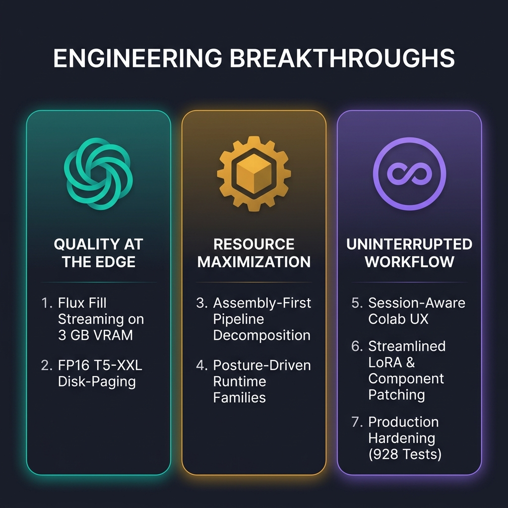

# Nexfocus

> **Field notebook from a deep expedition into image generation infrastructure — built for the edges, pressure-tested on extreme hardware.**

---

## Why This Exists

Most image generation UIs treat the pipeline as a black box — install the dependencies, call the model, display the result. We wanted to understand what was actually happening inside that box. Even earlier models like Stable Diffusion 1.5 internalized vast visual knowledge from billions of images, yet their true potential remained locked behind environmental limitations. The bottleneck was never the model's capability — it was the environment it operated in. An image is a 2D representation of 3D spatial data, while human language is one-dimensional, linear, and imprecise. Text prompting alone creates a structural mismatch between the interface and the task. LoRAs, ControlNets, and inpainting masks introduced essential external guidance, but remained bolted onto a language-first paradigm.

Rather than theorizing about what a better environment should look like, we chose to scout the terrain. We took [Fooocus](https://github.com/lllyasviel/Fooocus) — an established image generation application — decomposed it to its foundations, and traced how models load, how memory flows, how pipelines execute, and where the real bottlenecks hide. What started as a fork became a deep infrastructure expedition. The result is a fully functional application — you can generate, inpaint, outpaint, upscale, and remove objects — and a field notebook documenting everything we learned about how these pipelines actually work.

---

## Built for the Edges

Development was guided by a core engineering belief:

> **Everyone should be able to run serious image AI, even on an old PC or no PC at all.**

To enforce this principle, every architectural decision was pressure-tested against two reference hardware anchors representing the extreme edges of real-world access:

| Anchor | Target User | Hardware Profile | Constraint Profile |
|:---|:---|:---|:---|
| **Local Edge** | Old PC | **NVIDIA GTX 1050** 3 GB VRAM / 32 GB RAM | Extreme VRAM scarcity. Every byte allocated is audible. Represents legacy dedicated hardware users cannot afford to upgrade. |
| **Cloud Edge** | No PC at all | **Google Colab Free (T4)** 16 GB VRAM / 12.7 GB System RAM | System RAM ceiling. Single-cell notebook execution. Ephemeral GPU availability and session timeouts. |

These anchors were not passive test environments; they were hard engineering boundaries. At the edge, subtle inefficiencies and unowned framework dispatches get amplified into visible execution noise. By designing for these hard boundaries, every optimization directly benefited constrained environments while ensuring high-end systems ran with effortless efficiency.

---

## Engineering Breakthroughs

Our technical discoveries span seven key breakthroughs organized across three thematic pillars:

### Pillar I: Highest Performance Without Quality Compromise at the Edge

Our generation pipeline went through several structural evolutions. The concept of tensor streaming originated from a simple realization: **as long as the GPU compute core is fully engaged without idle gaps, the UNet weight tensor can reside anywhere.** The engineering challenge was keeping the compute core continuously saturated while managing severe VRAM and system RAM ceilings.

#### 1. Flux Fill Streaming on 3 GB VRAM
- **The Impossible Result:** The 12.7 GB Flux Fill UNet model executes smoothly on a legacy 3 GB GTX 1050 graphics card.
- **The Insight:** GPU utilization — not static data locality — is the primary performance metric. By constructing stage-contracted worker assemblies with explicit memory lifecycle management, full FP8 weights stream through pipeline-owned allocations. The GPU never idles waiting for tensor chunks because the pipeline stages ensure the next allocation is ready before the current compute step completes.
- **The Technical Depth:** PyTorch’s default `CUDACachingAllocator` buffers VRAM behind the application's back, causing unexpected out-of-memory crashes during dynamic streaming. Bypassing this required building explicit memory lifecycles underneath high-level PyTorch calls to control memory allocation down to the byte.

#### 2. FP16 T5-XXL Disk-Paging (Quality-First Engineering)
- **The Impossible Result:** The 9.5 GB T5-XXL text encoder runs within Google Colab Free's 12.7 GB RAM limit at full FP16 precision without requiring 24 GB of system RAM.
- **The Quality-First Decision:** Standard approaches fit T5 into low-RAM systems by quantizing the encoder to FP8. However, because T5-XXL utilizes an encoder-decoder architecture, FP8 quantization severely degrades text conditioning and prompt fidelity. We refused to compromise prompt adherence to fit hardware constraints.
- **The Technical Depth:** Instead of quantizing, we engineered a managed disk-paging strategy that loads T5 weight slices from disk in structured pages rather than materializing the full 9.5 GB tensor in system RAM. This preserved full FP16 text conditioning while eliminating the 24 GB RAM barrier for Flux pipelines.
- **The Principle:** *Do not sacrifice output quality to fit the hardware; engineer the infrastructure so the hardware can handle full quality.*

---

### Pillar II: Tapping & Maximizing Hardware Resource Efficiency

System resources — disk storage, CPU cores, system RAM, GPU memory, and VRAM bandwidth — are all assets available to the image generation process. The central engineering question was how to efficiently allocate, distribute, and execute workloads across these heterogeneous resources.

#### 3. Assembly-First Pipeline Decomposition
- **The Impossible Result:** The SDXL execution pipeline was systematically disassembled and rebuilt from inherited Fooocus dispatches into clean worker assemblies with explicit stage contracts.
- **The Insight:** Across 18 Phase 4 infrastructure missions, we discovered that approximately 90% of execution overhead was not model matrix multiplication — it was framework dispatch latency, redundant tensor copying, and lifecycle decisions made by unowned software layers.
- **The Journey:** This architecture did not emerge from clean planning. An early mission (M06) failed — exposing a critical loader memory flaw (6.7 GB of duplicated tensor data) and a 67% performance gap. That failure forced the methodology pivot that produced the assembly-first approach.
- **The Technical Depth:** Pipeline stages were restructured into dedicated worker assemblies. Each assembly owns its inputs, outputs, and memory disposal contracts, eliminating hidden intermediate allocations and framework dispatch latency.

#### 4. Posture-Driven Runtime Families
- **The Impossible Result:** SDXL streaming, SDXL resident, and Flux Fill execute under a unified pipeline contract while operating dedicated memory policies tailored across five distinct hardware profiles.
- **The Insight:** Runtime postures are not simple conditional flag switches (`if low_vram:`). Each posture represents a distinct execution architecture — utilizing different worker assembly compositions, memory lifecycle contracts, and resource policies.
- **The Technical Depth:** Low-VRAM postures prioritize active tensor streaming and immediate offloading; high-VRAM postures maximize residency to eliminate transfer overhead. All postures present an identical interface to the application UI.

---

### Pillar III: Engineering Toward an Uninterrupted Workflow

An uninterrupted workflow and fast operational speed were persistent engineering targets. A core principle was to preserve and reuse every pipeline component — model spine, loaded weight states, and runtime artifacts — that didn't need to change, so the user never waits for unnecessary recomputation. Beyond system RAM constraints, running on Google Colab Free presented a major usability barrier: single-cell notebook execution prevents parallel background operations, meaning users traditionally had to stop the app cell to download new models. We invested engineering effort into removing every execution barrier we could find.

#### 5. Session-Aware Colab UX
- **The Impossible Result:** Users on Colab Free can browse model catalogues, preview thumbnails, trigger background model downloads, and switch presets without leaving the running web UI or risking session disconnection.
- **The Insight:** On Colab Free, stopping the notebook cell to download models risks losing scarce GPU allocations. In an ephemeral environment, an in-app model browser is not a convenience feature — it is a critical session-preservation mechanism.
- **The Technical Depth:** Implemented an asynchronous model management worker that streams weights directly into the designated directory during live UI execution while protecting active memory allocations.

#### 6. User-First Pipeline Engineering (The UNet-Only LoRA Story)
- **The Impossible Result:** Comprehensive workflow enhancements including component-aware LoRA patching, custom HTML/JS overlay masking (90% CPU load reduction), a floating staging palette, GIMP integration, and validated metadata round-tripping (generation parameters survive save, reload, and sharing).
- **The UNet-Only LoRA Commitment:** Standard LoRAs apply weight adaptations to both the UNet and CLIP text encoders. However, many community LoRAs are UNet-only. Inherited patching pipelines applied weights uniformly; if CLIP weights were missing, the process would either fail or require a full pipeline reload. The simple solution would be asking users to avoid UNet-only LoRAs. Instead, we rearchitected the LoRA patching lifecycle to track and manage UNet and CLIP weight states independently. When a UNet-only LoRA is loaded, the pipeline patches the UNet while leaving the existing CLIP state intact. While skipping CLIP repatching saves only seconds, this architectural refinement reflects our commitment to delivering a frictionless, speedy user experience.
- **Custom Overlay Masking:** Replaced the default Gradio `ImageEditor` canvas (which consumed up to 90% CPU load during mask drawing) with a lightweight HTML/JS overlay canvas, restoring fluid painting performance on low-spec hardware.

#### 7. Production Hardening
- **The Impossible Result:** 928 automated unit and integration tests passing continuously across all supported execution postures.
- **The Insight:** No other Fooocus fork maintains a test suite, a logging contract, or a compatibility-bridge registry. This is release engineering applied to a project that most people would treat as a hobby fork.
- **The Technical Depth:** Built a comprehensive logging contract (normal/debug levels), a compatibility-bridge registry for legacy settings, and key-binding verification. Structural stability is maintained across every hardware profile.

---

## Constraint-to-Benefit Pattern

The core engineering stories of Nexfocus follow a direct relationship between hardware constraints and user benefits:

| Constraint | Architectural Discovery | Engineering Solution | User Benefit |
|:---|:---|:---|:---|
| **3 GB VRAM** | PyTorch caching allocator fights explicit tensor streaming | Stage-contracted worker assemblies with explicit memory lifecycles | **Flux Fill runs on a 3 GB GTX 1050** |
| **12.7 GB System RAM** | T5-XXL requires ~9.5 GB in RAM; FP8 quantization degrades prompt fidelity | FP16 managed disk-paging loading structured weight slices | **Flux generation without needing 24 GB RAM** |
| **Single-Cell Notebook** | Stopping the app cell to download models risks losing Colab GPU session | In-app model browser with background download manager | **Never lose a Colab GPU session** |
| **UNet-Only LoRAs** | Standard patching repatches both UNet and CLIP text encoders uniformly | Component-aware patching lifecycle reuses existing CLIP state | **Every LoRA patches cleanly without workflow breaks** |
| **Gradio ImageEditor Lag** | Canvas mask painting consumed 90% CPU load on low-spec devices | Custom HTML5/JS overlay canvas bypassing Gradio editor overhead | **Fluid, responsive inpaint mask painting** |
| **Unfocused Iteration** | Constant Alt-Tabbing required to compare visual generation variants | Floating staging palette with drag-and-drop workflow | **Review & compare outputs without leaving the app** |

---

## Differentiators from Upstream Fooocus

Nexfocus introduces significant structural advancements over upstream Fooocus:

| Technical Dimension | Upstream Fooocus | Nexfocus |
|:---|:---|:---|
| **Runtime Architecture** | Inherited Fooocus dispatch pipeline | **Assembly-first worker compositions with stage contracts** |
| **VRAM Management** | Framework-managed (PyTorch allocator) | **Nex-owned memory lifecycles per hardware posture** |
| **Flux Fill Support** | Not supported | **Full streaming runtime (3 GB VRAM capable)** |
| **T5 Text Encoder** | Requires full tensor materialization in RAM | **FP16 disk-paged managed weight loading** |
| **Model Management** | External / manual file downloads | **In-app browser with thumbnails & download-on-demand** |
| **LoRA Patching** | Uniform application across components | **Component-aware routing (reuses CLIP state for UNet LoRAs)** |
| **Inpainting Engine** | Legacy `InpaintHead` mechanism | **`denoise_mask` pipeline with native aspect ratio blending** |
| **Masking Canvas** | Gradio `ImageEditor` (CPU intensive) | **Custom HTML/JS overlay canvas (90% CPU load reduction)** |
| **Automated Test Suite** | None maintained | **928 passing tests with maintained contract** |
| **Logging Contract** | Ad-hoc print statements | **Structured normal / debug logging contract** |
| **Metadata Round-Trip** | Basic text parameter extraction | **Validated schema round-trip with hotkey bindings** |

---

## Pipeline Ownership & Architecture

Throughout 18 infrastructure missions, a central narrative thread emerged: **taking ownership of the execution pipeline back from framework abstractions.** High-level framework wrappers provide convenience, but hide caching allocators, unowned dispatch latency, and implicit tensor duplications.

By disassembling the pipeline into explicit worker assemblies, Nexfocus reclaims direct control over memory allocation and device scheduling. Every breakthrough in this repository — from streaming 12.7 GB models on 3 GB GPUs to disk-paging T5 text encoders — resulted from taking ownership of one more segment of the generation pipeline.

---

## Documentation Navigation

Detailed setup instructions, operational guides, and developer contracts are available in separate reference documents:

- 📖 **[INSTALL.md](INSTALL.md):** Complete installation guide for Windows (standalone & venv), Linux (conda & venv), and Google Colab.
- ⌨️ **[HOTKEYS.md](HOTKEYS.md):** Comprehensive keyboard shortcut map and navigation controls.
- 🛠️ **[CONTRIBUTING.md](CONTRIBUTING.md):** Developer contribution guidelines, code style standards, and the 928-test maintenance contract.
- 📘 **[GUIDE.md](GUIDE.md):** Basic user tutorial — getting started with generation, inpainting, upscaling, and key workflows.

---

## What's Next

> **Project Status:** This repository represents a completed infrastructure scout mission and is currently in **maintenance mode** (critical bug fixes only).

Having taken ownership of everything the PyTorch execution layer allows, the team is exploring a native C++ tensor and memory layer for the next generation of image synthesis infrastructure.

---

## Credits & License

### Attribution
Nexfocus originated as a fork of [Fooocus](https://github.com/lllyasviel/Fooocus) by [lllyasviel](https://github.com/lllyasviel). We express our gratitude to the upstream authors and the broader open-source generative AI community for establishing the foundational codebases.

### Pair Programming Model
This project was developed through an **AI-assisted pair programming model** — combining the creative direction and domain insight of a 3D artist with an agentic AI coding assistant.

### License
This project is licensed under the **GNU General Public License v3.0 (GPL-3.0)**. See the [LICENSE](LICENSE) file for details.
